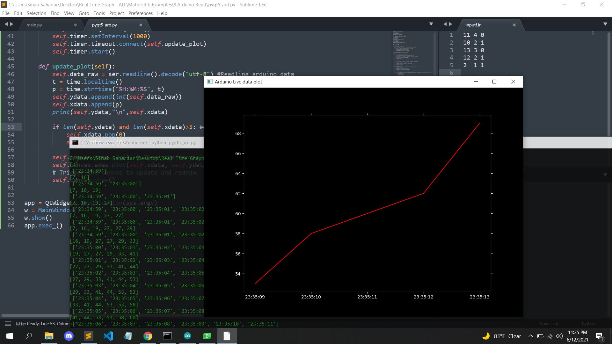

# Arduino-Matplotlib-Example
This is real time graph plotting application. Using PyQt5 and Matplotlib, I developed this application to plot live graph from arduino data(you can use any sensor).

Screenshot
---------------

